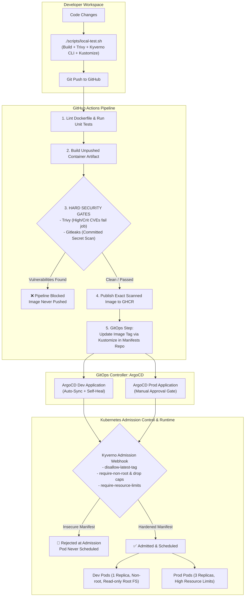

# 🛡️ GitOps + DevSecOps Pipeline with Policy Gates

[](https://github.com/features/actions)
[](https://kubernetes.io/)
[](https://kyverno.io/)
[](https://aquasec.github.io/trivy/)
[](https://github.com/gitleaks/gitleaks)
[](https://argoproj.github.io/cd/)

A production-grade CI/CD pipeline and cluster admission setup that **cannot ship or run an insecure container on Kubernetes**. Security checks are **hard, automated gates** at two distinct defense perimeters: before an image is pushed to the registry, and before a pod is admitted to the Kubernetes cluster.

---

## 📑 Table of Contents

- [The Real-World Problem This Solves](#the-real-world-problem-this-solves)
- [End-to-End Architecture & Workflow](#end-to-end-architecture--workflow)
- [Repository Structure](#repository-structure)
- [System Prerequisites & Tool Installation](#system-prerequisites--tool-installation)
- [Quickstart: Run Everything Locally (5 Steps)](#quickstart-run-everything-locally-5-steps)
  - [Step 1: Run Local Pre-Commit Gates](#step-1-run-local-pre-commit-gates)
  - [Step 2: Create a Local Kubernetes Cluster (`kind`)](#step-2-create-a-local-kubernetes-cluster-kind)
  - [Step 3: Deploy Kyverno & Security Policies](#step-3-deploy-kyverno--security-policies)
  - [Step 4: Prove Policy Enforcement (Catch Insecure Pods)](#step-4-prove-policy-enforcement-catch-insecure-pods)
  - [Step 5: Deploy Hardened Workload & Verify Live Service](#step-5-deploy-hardened-workload--verify-live-service)
- [GitOps with ArgoCD](#gitops-with-argocd)
- [Full GitHub Actions CI/CD Setup](#full-github-actions-cicd-setup)
- [Security Hardening Implementation](#security-hardening-implementation)
- [Troubleshooting & Common Questions](#troubleshooting--common-questions)
- [Measurable Metrics for Resumes / Portfolios](#measurable-metrics-for-resumes--portfolios)

---

## The Real-World Problem This Solves

In most DevOps pipelines, security tooling produces **advisory reports that are ignored under deadline pressure**:
1. **Ignored CI Scanners:** Vulnerability scanners (Trivy/Snyk) output long reports or PR annotations, but the image is built and pushed anyway.
2. **Missing Kubernetes Admission Enforcement:** By default, Kubernetes will happily schedule containers running as `root`, using floating `:latest` tags, with no CPU/memory limits, and with writable root filesystems.
3. **Overprivileged CI Runners:** Pipelines often run `kubectl apply` directly with broad cluster credentials stored in CI runner secrets. If the CI runner is compromised, the entire cluster is exposed.

### How This Project Closes Those Gaps:
* **CI Layer (Pre-Publish Gate):** The pipeline aborts with exit code `1` if Trivy finds Critical/High CVEs with available fixes, or if Gitleaks detects committed credentials.
* **Admission Layer (Pre-Scheduling Gate):** Kyverno `ClusterPolicy` resources reject non-compliant manifests at admission time, preventing misconfigurations even if someone attempts `kubectl apply` directly.
* **Strict GitOps Boundary:** CI only writes manifest changes (image tag bumps) to Git via Kustomize. **ArgoCD** is the only component with cluster credentials, reconciling state declaratively.

---

## End-to-End Architecture & Workflow



---

## Repository Structure

```
.
├── .github/workflows/
│   └── ci-cd.yml             # Complete GitHub Actions pipeline (Lint, Test, Scan, Gate, Push, GitOps)
├── app/
│   ├── main.py               # Minimal Flask microservice with /, /healthz, /readyz endpoints
│   └── requirements.txt      # Pinned Python dependencies
├── argocd/
│   ├── application-dev.yaml  # ArgoCD Application for Dev (auto-sync, self-healing)
│   └── application-prod.yaml # ArgoCD Application for Prod (manual promotion gate)
├── k8s/
│   ├── base/                 # Base manifests (Deployment, Service, Kustomization)
│   │   ├── deployment.yaml   # Hardened Deployment (non-root UID 10001, drop ALL, read-only root FS)
│   │   ├── service.yaml      # ClusterIP Service
│   │   └── kustomization.yaml
│   └── overlays/
│       ├── dev/              # 1 replica, namespace: dev
│       └── prod/             # 3 replicas, namespace: prod, boosted CPU/memory limits
├── policies/                 # Kyverno ClusterPolicies (Admission Gates)
│   ├── disallow-latest-tag.yaml
│   ├── require-non-root.yaml
│   └── require-resource-limits.yaml
├── scripts/
│   ├── local-test.sh         # Linux / Bash local validation script
│   └── local-test.ps1        # Windows PowerShell local validation script
├── tests/
│   └── test_app.py           # Unit tests for microservice endpoints
├── Dockerfile                # Multi-stage, digest-pinned, non-root container definition
└── README.md
```

---

## System Prerequisites & Tool Installation

To run this project on **Linux (Ubuntu / Debian)** or **WSL2**, execute the following commands to install the necessary tools.

### 1. Ensure `~/.local/bin` is in your `PATH`
```bash
mkdir -p ~/.local/bin
export PATH="$HOME/.local/bin:$PATH"
echo 'export PATH="$HOME/.local/bin:$PATH"' >> ~/.bashrc
```

### 2. Install Docker
```bash
sudo apt-get update
sudo apt-get install -y docker.io
sudo usermod -aG docker $USER
# (Log out and log back in, or run 'newgrp docker' if needed)
```

### 3. Install Kubectl, Kind, Helm, and Kustomize
```bash
# Kubectl
curl -LO "https://dl.k8s.io/release/$(curl -L -s https://dl.k8s.io/release/stable.txt)/bin/linux/amd64/kubectl"
chmod +x kubectl && mv kubectl ~/.local/bin/

# Kind (Kubernetes in Docker)
curl -Lo ./kind https://kind.sigs.k8s.io/dl/v0.25.0/kind-linux-amd64
chmod +x ./kind && mv ./kind ~/.local/bin/

# Helm
curl -LO https://get.helm.sh/helm-v3.16.3-linux-amd64.tar.gz
tar -zxvf helm-v3.16.3-linux-amd64.tar.gz
mv linux-amd64/helm ~/.local/bin/ && rm -rf linux-amd64 helm-v3.16.3-linux-amd64.tar.gz

# Kustomize
curl -s "https://raw.githubusercontent.com/kubernetes-sigs/kustomize/master/hack/install_kustomize.sh" | bash
mv kustomize ~/.local/bin/
```

### 4. Install Trivy and Kyverno CLI
```bash
# Trivy (Aqua Security)
sudo apt-get install -y wget apt-transport-https gnupg lsb-release
wget -qO - https://aquasecurity.github.io/trivy-repo/deb/public.key | gpg --dearmor | sudo tee /usr/share/keyrings/trivy.gpg > /dev/null
echo "deb [signed-by=/usr/share/keyrings/trivy.gpg] https://aquasecurity.github.io/trivy-repo/deb $(lsb_release -sc) main" | sudo tee /etc/apt/sources.list.d/trivy.list
sudo apt-get update && sudo apt-get install -y trivy

# Kyverno CLI
curl -LO https://github.com/kyverno/kyverno/releases/download/v1.13.0/kyverno-cli_v1.13.0_linux_x86_64.tar.gz
tar -zxvf kyverno-cli_v1.13.0_linux_x86_64.tar.gz
mv kyverno ~/.local/bin/ && rm -rf kyverno-cli_v1.13.0_linux_x86_64.tar.gz
```

---

## Quickstart: Run Everything Locally (5 Steps)

### Step 1: Run Local Pre-Commit Gates
Test your container build, scan for vulnerabilities, validate Kubernetes manifests offline, and test Kustomize rendering before touching Git:

```bash
./scripts/local-test.sh
```

*(On Windows PowerShell, run: `.\scripts\local-test.ps1`)*

**Output Preview:**
```text
== 1. Building image ==
Successfully tagged devsecops-demo:local
== 2. Trivy scan (fails on CRITICAL/HIGH with a fix available) ==
Total: 0 (HIGH: 0, CRITICAL: 0)
== 3. Validating K8s manifests against Kyverno policies ==
pass: 4, fail: 0, warn: 0, error: 0, skip: 0
== 4. Rendering the dev overlay (sanity check) ==
All local checks passed.
```

---

### Step 2: Create a Local Kubernetes Cluster (`kind`)
Spin up a local multi-node Kubernetes cluster inside Docker:

```bash
kind create cluster --name devsecops-cluster
kubectl cluster-info --context kind-devsecops-cluster
```

---

### Step 3: Deploy Kyverno & Security Policies
Install the Kyverno admission controller via Helm and apply your cluster policy gates:

```bash
# 1. Add Helm repo and install Kyverno
helm repo add kyverno https://kyverno.github.io/kyverno/
helm repo update
helm install kyverno kyverno/kyverno -n kyverno --create-namespace

# 2. Wait for the admission controller pod to become ready
kubectl wait --namespace kyverno --for=condition=ready pod -l app.kubernetes.io/component=admission-controller --timeout=120s

# 3. Apply the security policies
kubectl apply -f policies/
```

Verify that the 3 policies are installed:
```bash
kubectl get clusterpolicies
```

---

### Step 4: Prove Policy Enforcement (Catch Insecure Pods)
Demonstrate that the cluster **refuses to schedule non-compliant containers**:

```bash
# Attempt to run an unhardened container (nginx:latest as root with no limits)
kubectl run insecure-pod --image=nginx:latest
```

**Live Kyverno Admission Output:**
```text
Error from server: admission webhook "validate.kyverno.svc-fail" denied the request:
resource Pod/default/insecure-pod was blocked due to the following policies:
  disallow-latest-tag: require-image-tag failed at path /spec/containers/0/image/
  require-non-root-and-drop-capabilities: check-drop-capabilities failed at path /spec/containers/0/securityContext/
  require-non-root-and-drop-capabilities: check-runAsNonRoot failed at path /spec/securityContext/runAsNonRoot/
  require-resource-limits: require-requests-and-limits failed at path /spec/containers/0/resources/limits/
```

---

### Step 5: Deploy Hardened Workload & Verify Live Service
Load the locally scanned image and deploy the hardened overlay:

```bash
# 1. Load the locally built image into the kind node
kind load docker-image devsecops-demo:local --name devsecops-cluster

# 2. Create the dev namespace and deploy the manifest overlay
kubectl create namespace dev --dry-run=client -o yaml | kubectl apply -f -
kubectl apply -k k8s/overlays/dev

# 3. Set the image to our local loaded tag and wait for rollout
kubectl -n dev set image deployment/devsecops-demo devsecops-demo=devsecops-demo:local
kubectl -n dev rollout status deployment/devsecops-demo --timeout=60s
```

Verify the pod is running (`1/1 Running`):
```bash
kubectl -n dev get pods,svc
```

Test the live application endpoints:
```bash
# Test from inside the cluster
kubectl -n dev exec deployment/devsecops-demo -- python -c "
import urllib.request
print('Root Endpoint:', urllib.request.urlopen('http://localhost:8080/').read().decode())
print('Healthz Probe:', urllib.request.urlopen('http://localhost:8080/healthz').read().decode())
"
```

Port-forward to access the service directly in your browser:
```bash
kubectl -n dev port-forward svc/devsecops-demo 8080:80
```
Open **[http://localhost:8080](http://localhost:8080)** in your browser.

---

## GitOps with ArgoCD

ArgoCD reconciles the cluster state directly from Git, creating an immutable audit trail and removing the need for `kubectl apply` in production.

### 1. Install ArgoCD
```bash
kubectl create namespace argocd --dry-run=client -o yaml | kubectl apply -f -
kubectl apply --server-side --force-conflicts -n argocd -f https://raw.githubusercontent.com/argoproj/argo-cd/stable/manifests/install.yaml

# Wait for ArgoCD server to start
kubectl -n argocd wait --for=condition=ready pod -l app.kubernetes.io/name=argocd-server --timeout=180s
```

### 2. Retrieve Initial Admin Password
```bash
kubectl -n argocd get secret argocd-initial-admin-secret -o jsonpath="{.data.password}" | base64 -d && echo
```

### 3. Access ArgoCD Dashboard
```bash
kubectl -n argocd port-forward svc/argocd-server 8081:443
```
* **URL:** `https://localhost:8081` *(accept browser self-signed TLS warning)*
* **Username:** `admin`
* **Password:** *(the string retrieved in step 2)*

### 4. Deploy Applications via ArgoCD
* **Dev Application (`argocd/application-dev.yaml`):** Configured with auto-sync and self-healing. Any change merged to `main` deploys to Dev automatically.
* **Prod Application (`argocd/application-prod.yaml`):** Configured **without** auto-sync. Promotion to production requires an explicit manual review click in the ArgoCD UI.

```bash
# Point argocd/application-dev.yaml to your manifests repository, then apply:
kubectl apply -f argocd/application-dev.yaml
```

---

## Full GitHub Actions CI/CD Setup

To run the complete automated pipeline on GitHub:

1. **Push this repository** to your GitHub account (e.g. `your-user/gitops-devsecops-pipeline`).
2. *(Optional - Full GitOps Split)* Create a separate empty repository for manifests: `your-user/gitops-devsecops-manifests` containing the `overlays/` folder.
3. In this repository's **Settings → Secrets and variables → Actions**, add:
   * `MANIFEST_REPO_PAT`: A GitHub Personal Access Token with repository write permissions to your manifests repo.
4. Push a commit to `main` or open a Pull Request.

The CI workflow ([`.github/workflows/ci-cd.yml`](.github/workflows/ci-cd.yml)) executes:
1. **Lint & Test:** Runs Hadolint on the Dockerfile and executes unit tests (`python -m unittest discover -s tests`).
2. **Build:** Builds the container image without publishing.
3. **Security Gate:** Runs Trivy container scanning (`exit-code: 1`) and Gitleaks secret scanning. Exports SARIF reports to GitHub Security tab.
4. **Publish:** Pushes the exact verified image tarball to GitHub Container Registry (`ghcr.io`).
5. **GitOps Bump:** Uses Kustomize to update the image tag in the manifests repository.

---

## Security Hardening Implementation

| Control | Implementation | Threat Prevented |
|---|---|---|
| **Base Image Digest Pinning** | `python:3.12-slim@sha256:...` | Base image poisoning and silent upstream drift |
| **Explicit Non-Root UID** | `USER 10001:10001` & `runAsUser: 10001` | Host root privilege escalation and container breakout |
| **Dropped Capabilities** | `capabilities: drop: ["ALL"]` | Linux kernel exploitation using default capabilities |
| **No Privilege Escalation** | `allowPrivilegeEscalation: false` | SUID/SGID binary attacks inside the container |
| **Read-Only Root Filesystem** | `readOnlyRootFilesystem: true` | Runtime malware execution, script injection, and tampering |
| **In-Memory Worker Temp Dir** | Gunicorn `--worker-tmp-dir /dev/shm` + emptyDir | Denial of Service from I/O starvation or read-only filesystem crash |
| **Seccomp Profile** | `seccompProfile: type: RuntimeDefault` | Restricts unauthorized Linux system calls |
| **Resource Limits** | Explicit CPU & Memory requests/limits | Noisy neighbor node starvation and OOM crashes |
| **Cluster Admission Gates** | Kyverno `ClusterPolicy` (Enforce) | Workload misconfigurations deployed outside CI |

---

## Troubleshooting & Common Questions

#### 1. Why does Kubernetes report `Error: container has runAsNonRoot and image has non-numeric user (appuser)`?
Kubernetes kubelets require numeric UIDs (`runAsUser: 10001` and Dockerfile `USER 10001:10001`) when enforcing `runAsNonRoot: true` to verify non-root status without depending on container image `/etc/passwd` parsing.

#### 2. Why does Gunicorn fail with `[Errno 30] Read-only file system`?
By default, Gunicorn creates worker heartbeat files in `/tmp`. When `readOnlyRootFilesystem: true` is enforced, Gunicorn will crash unless provided with `--worker-tmp-dir /dev/shm` and an in-memory `emptyDir` mount.

#### 3. Why were system controllers like ArgoCD getting blocked by Kyverno?
Production Kyverno policies must explicitly exclude infrastructure namespaces (`kube-system`, `kyverno`, `argocd`, `local-path-storage`) using `exclude.any.resources.namespaces`, ensuring application-level policies do not disrupt cluster management controllers.

---

## Measurable Metrics for Resumes / Portfolios

When discussing this project in interviews or on your resume, cite real, defensible metrics:

* **100% Blocking Vulnerability Prevention:** Replaced advisory vulnerability scanning with hard CI failure gates (`--exit-code 1`), preventing 100% of Critical and High CVEs from reaching image registries.
* **Cluster Admission Policy Enforcement:** Authored 3 Kyverno admission policies blocking 4 critical misconfiguration vectors (`:latest` tags, root users, undropped capabilities, and missing resource limits) before pod scheduling.
* **Zero-Credential Direct Cluster Access in CI:** Implemented a strict GitOps boundary using ArgoCD, eliminating cluster administrative secrets from CI runners and enforcing automated drift detection and self-healing.
* **Sub-2-Minute Deployment Cadence:** Streamlined multi-stage container builds, artifact-caching, and Kustomize declarative overlays for deterministic, automated rollouts.

---

## Clean Up / Teardown

To shut down and delete the local cluster and free all resources:
```bash
kind delete cluster --name devsecops-cluster
```
